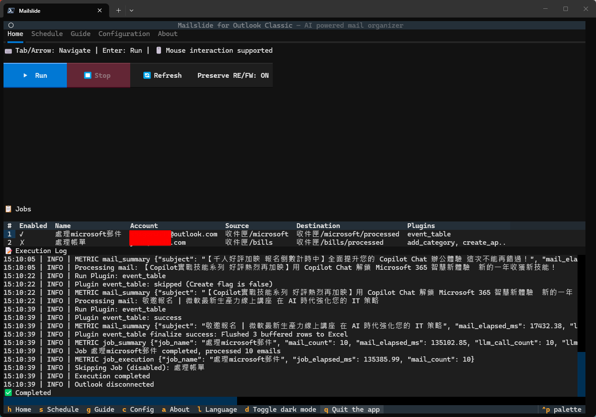
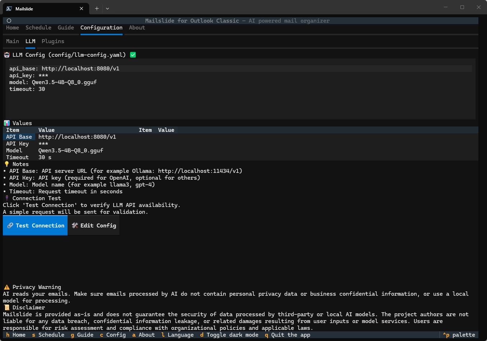
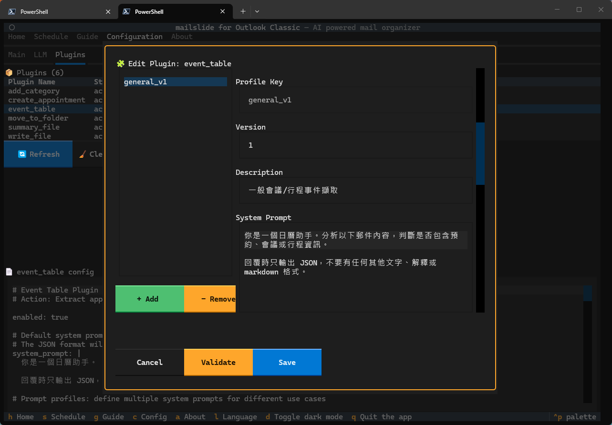

# Mailslide

A Windows + Outlook Classic automation tool for turning repetitive email work into reliable workflows.
Use configurable jobs and optional LLM plugins to classify, route, summarize, and structure email processing.

Language: [English](README.md) | [Traditional Chinese](README.zh-TW.md)

> Warning: AI reads your emails. Make sure emails processed by AI do not contain personal privacy data or business confidential information, or use a local model for processing.
>
> Disclaimer: This project is provided as-is and does not guarantee the security of data processed by third-party or local AI models. The project authors are not liable for any data breach, confidential information leakage, or related damages resulting from user inputs or model services. Users are responsible for risk assessment and compliance with organizational policies and applicable laws.

## Why Mailslide

- Standardize Outlook processing with repeatable job-based workflows.
- Go beyond classification: move folders, create appointments, export JSON/CSV/Excel.
- Keep deployment flexible: OpenAI-compatible APIs or local models (Ollama, llama.cpp).
- Friendly for non-developers: initialize and edit configs directly in the TUI.

## Typical use cases

- Operations and assistants: triage meeting requests, alerts, and routine inbox traffic.
- PMs and sales: convert email streams into trackable events and summaries.
- Engineering and support: auto-tag and prioritize incoming threads.

## Recent workflow updates

- Home -> Stop now halts a running job from the Home tab.
- Configuration -> General -> Reload rereads `config/config.yaml` from disk.
- Plugin settings now support prompt profiles, and renaming a profile key tries to keep related job references in sync.

## 30-second start (End users)

```bash
uv tool install mailslide
mailslide-tui
```

After first launch, open **About** and click **Initialize Config**.

Upgrade:

```bash
uv tool upgrade mailslide
```

Pre-release compatibility (LLM path):

- Canonical LLM dependency policy is defined in `pyproject.toml` under `project.optional-dependencies.llm`.
- Current incident-closure policy for LLM execution path is `httpx<1`.
- Release-candidate validation evidence lives in `docs/releases/evidence/` (for this RC: `docs/releases/evidence/0.4.0-rc2.md`).

When a release changes `config` schema, the app auto-migrates `config/config.yaml` on load and writes a timestamped backup (for example: `config.yaml.bak.20260327_153000`).

## 30-second start (Developers / source mode)

```bash
uv sync
uv run app.py
```

Then in TUI:

1. Open **About** and click **Initialize Config**.
2. Open **Configuration** and set Jobs / LLM / Plugins.
3. Return to **Home** and run a job (`Preserve RE/FW` is `ON` by default and can be toggled on Home).

## Import Path Migration

- Canonical path: `mailslide`
- Legacy path: `outlook_mail_extractor` (**deprecated**, planned removal in the next major release)

| Legacy | New |
|---|---|
| `from outlook_mail_extractor import load_config` | `from mailslide import load_config` |
| `python -m outlook_mail_extractor` | `python -m mailslide` |
| `uv run outlook_mail_extractor` | `uv run mailslide` |

## Screenshots





## Plugin Capability Matrix

| Plugin | Primary purpose | LLM required | Typical output |
|---|---|---|---|
| `add_category` | Classify emails and add categories | Yes | Outlook category tags |
| `move_to_folder` | Decide and move target folders | Yes | Folder move result |
| `create_appointment` | Create calendar items from email content | Yes | Outlook calendar items |
| `event_table` | Extract event data into a table | Yes | `output/events.xlsx` |
| `summary_file` | Generate summaries and priorities | Yes | `output/email_summaries.csv` |
| `write_file` | Export raw email data | No | `output/*.json` |

## Full Guide

- English: `GUIDE.en.md`
- Traditional Chinese: `GUIDE.md`

The TUI `Guide` tab now prefers `GUIDE.en.md` / `GUIDE.md` and falls back to `README` files for compatibility.

## Requirements

- Windows
- Outlook Classic (not New Outlook)
- Outlook must stay open while running

## License

`GPL-3.0-or-later`. See `LICENSE`.
